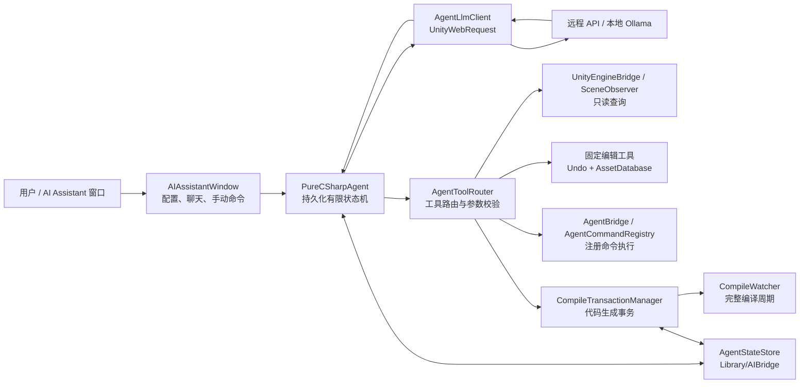
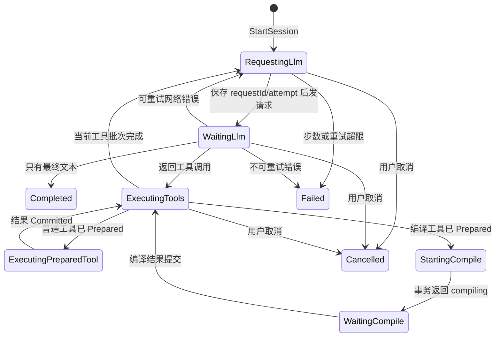
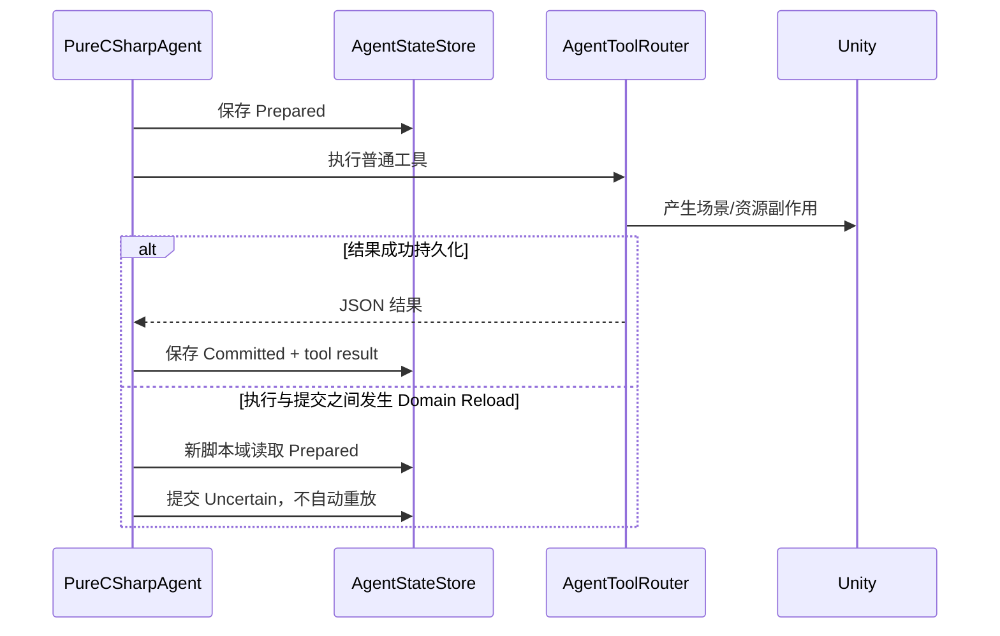
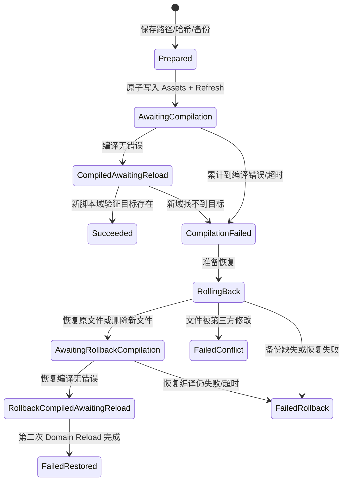

# AI Bridge 2.0 架构与逻辑流程

> 文档基线：AI Bridge `2.0.0`，代码审阅日期 `2026-07-16`。文件名和类名均来自当前仓库。

## 1. 架构目标

AI Bridge 的核心问题不是“怎样发一次 LLM 请求”，而是“怎样让一个会修改 C# 的 Unity Editor Agent 在 Domain Reload 后仍能安全继续”。当前架构围绕以下不变量设计：

1. 长生命周期不依赖 EditorWindow、`Task`、线程或静态内存；
2. 任何可能跨重载的意图先落盘，再产生副作用；
3. 普通副作用工具最多自动执行一次，不确定时先探查、后补偿；
4. 代码生成使用独立事务，编译与执行分离；
5. 编译失败必须恢复生成前状态，并等待恢复编译完成；
6. API Key 不进入 Agent 会话 JSON 或项目资源；
7. 所有 Unity 操作在主 Editor 进程和主线程中执行；
8. Asset Import Worker 不加载会话、不扫描命令、不推进事务。

非目标：

- 不是任意 C# 的安全沙箱；
- 不保证远程模型请求“恰好一次”；
- 不通过后台代理、Python 服务或本地监听器隔离执行；
- 不自动证明用户自定义 `[AgentCommand]` 安全；
- 不替代版本控制、代码评审和正式测试。

## 2. 总体分层

### 2.1 组件职责

| 组件 | 主要文件 | 单一职责 |
|---|---|---|
| UI | `Editor/AIAssistantWindow.cs` | 配置、聊天展示、手动命令、发送/停止会话 |
| Agent 调度 | `Editor/PureCSharpAgent.cs` | 每次 Editor update 推进一个持久化阶段 |
| 会话模型 | `Editor/AgentPersistentState.cs` | 阶段常量、消息、工具调用、编译事务数据结构 |
| 状态存储 | `Editor/AgentStateStore.cs` | 原子写入、`.bak` 回退、状态与历史路径 |
| Prompt | `Editor/AgentPromptBuilder.cs` | 生成系统规则、当前 Unity 版本和项目路径 |
| LLM 客户端 | `Editor/AgentLlmClient.cs` | OpenAI-compatible / Anthropic 请求和响应转换 |
| 工具 Schema | `Editor/AgentTools.json`、`AgentToolDefinitions.cs` | 提供给模型的工具定义和缓存加载 |
| 工具路由 | `Editor/AgentToolRouter.cs` | 固定工具、命令、代码生成的分派和校验 |
| 命令宿主 | `Editor/AgentBridge.cs` | 仅执行带 `[AgentCommand]` 的公有静态方法 |
| 命令注册 | `Runtime/Scripts/AgentCommandAttribute.cs` | 扫描引用 AIBridge Runtime 的程序集并建立命令表 |
| 场景观察 | `Editor/SceneObserver.cs` | 场景、对象、资产、命令和 AI 脚本查询 |
| 引擎适配 | `Editor/UnityEngineBridge.cs` | 将查询、编译错误和日志封装为 `IEngineBridge` |
| 编译观察 | `Editor/CompileWatcher.cs` | 按完整编译周期累计所有程序集错误 |
| 编译事务 | `Editor/CompileTransactionManager.cs` | 备份、原子写入、Domain Reload 验证和失败回滚 |
| 环境隔离 | `Editor/AgentEditorEnvironment.cs` | 识别 Asset Import Worker，阻止其启动 Agent |
| 环境检查 | `Editor/AgentEnvironmentValidator.cs` | 检查版本、工具 Schema、状态目录和命令宿主 |
| 凭据保护 | `Editor/AgentEncryptionUtility.cs` | API Key 规范化、版本化 AES 存取和旧格式迁移 |
| 配置 | `Editor/AIBridgeSettings.cs` | 保存非敏感模型、界面和执行开关 |

## 3. Editor 启动与初始化流程

Unity 加载脚本域后，多个 `[InitializeOnLoad]` 类型各自注册最小职责：

1. `AgentDomainIdentity` 为当前脚本域生成唯一 Token；
2. `AgentBridge`：
   - Asset Import Worker 中直接退出；
   - 注册 Unity 日志适配器；
   - 当前代码会创建用户命令模板文件；
   - 扫描 `[AgentCommand]`；
3. `PureCSharpAgent`：
   - 从 `agent-state.json` 或备份恢复会话；
   - 注册 `EditorApplication.update`；
   - 注册 `beforeAssemblyReload`；
   - 延迟调用恢复活跃阶段；
4. `CompileWatcher`：注册程序集编译开始/结束事件，并用 Editor update 收口完整周期；
5. `CompileTransactionManager`：注册 update，持续推进生成源码事务；
6. `AgentLogBuffer`：订阅 Unity 日志，供 `get_console_logs` 查询；
7. 用户打开窗口后，`AIAssistantWindow.OnEnable` 初始化工具定义、配置、历史和状态订阅。

`AgentBridge` 初始化只注册进程内日志与命令扫描，不会在商品根目录外创建文件。`compile_temp_method`、`compile_script` 和固定资源工具仅在用户启动任务并触发相应操作后写入各自受限目录。

## 4. 会话主流程

### 4.1 从窗口到会话

`AIAssistantWindow.SendUserMessage` 的顺序是：

1. 拒绝与现有活跃会话并发；
2. 规范化 API Key，并在启动前写入 `EditorPrefs`；
3. 把用户消息写入 `chat-history.json`；
4. 确认进程内 `AgentBridge` 已初始化；
5. 构造 `AgentSessionConfig`：服务商、最终 URL、模型、Key、语言、最大步骤和用户附加约束；
6. 把窗口内 user/assistant 对话转为持久化消息；
7. 调用 `PureCSharpAgent.StartSession`。

`StartSession` 创建新的 `sessionId`，把阶段设为 `RequestingLlm`，将最大步骤限制到 `1..80`，记录 Unity 版本与项目路径，插入系统 Prompt，然后原子保存 `agent-state.json`。

### 4.2 每次 Editor update 的推进原则

`PureCSharpAgent.Tick` 每次只处理当前阶段：

- 先让 `CompileTransactionManager.Tick` 推进编译事务；
- 状态读取失败时每 `5` 秒低频重试，不覆盖损坏文件；
- 取消优先；
- 进入或即将进入 Play Mode 时暂停；
- `RequestingLlm` → 启动请求；
- `WaitingLlm` → 轮询请求；
- `ExecutingTools` → 执行下一个工具；
- `StartingCompile/WaitingCompile` → 轮询编译事务；
- `ExecutingPreparedTool` → 重载恢复时返回不确定结果。

## 5. LLM 请求流程

### 5.1 请求前状态提交

新的逻辑决策会：

1. 检查最大步骤和最大尝试数；
2. 只在新决策时增加 `step`；
3. 创建稳定 `requestId`；
4. 增加 `llmAttempt`；
5. 先把阶段保存为 `WaitingLlm`；
6. 再通过 `AgentLlmClient.Start` 创建 `UnityWebRequest`。

因此 Domain Reload 即使中断网络对象，仍可知道“哪个逻辑决策正在请求”。恢复后使用同一会话状态有限重试，最多 `3` 次；退避时间按尝试数增加。

### 5.2 OpenAI-compatible 与 Anthropic

- OpenAI-compatible：POST 到配置的 `/chat/completions`，使用 `Authorization: Bearer <key>`，消息包含 `tools` 和标准 `tool_calls`。
- Claude：POST 到 `/v1/messages`，使用 `x-api-key` 和固定 `anthropic-version`；系统消息、`tool_use` 与 `tool_result` 会转换成 Anthropic 格式。
- 请求超时为 `120` 秒，`max_tokens` 为 `8192`。
- `408/409/425/429/5xx` 或无响应网络错误可重试；`401/403`、`402`、无效请求和无效响应不盲目重试。

### 5.3 响应分支

- 没有工具调用：把文本写入历史，阶段设为 `Completed`；
- 有工具调用：保存 assistant 消息与完整工具数组，阶段设为 `ExecutingTools`；
- 可重试失败：保留同一 `requestId`，计划下一次请求；
- 不可重试失败：记录具体服务商、URL、模型或错误分类，阶段设为 `Failed`。

## 6. 工具执行流程

### 6.1 统一调度

每个工具调用执行前，Agent 创建 `AgentToolExecutionState`：

- `operationId`：本次副作用的稳定 ID；
- `toolCallId`：关联模型返回；
- `toolName` 与原始参数；
- `status=Prepared`。

状态先保存，再把 `_operationId` 注入参数并调用 `AgentToolRouter.ExecuteTool`。结果被追加为 role=`tool` 的消息，执行状态改为 `Committed`，然后进入下一个工具。

### 6.2 普通工具的“不确定提交”

这是“最多一次自动执行”而非“恰好一次”。收到 `Uncertain` 后，模型必须重新查询场景或资源，再决定是否补偿。

### 6.3 固定工具

- 查询工具委托给 `UnityEngineBridge` 和 `SceneObserver`；
- 创建 GameObject、材质、设置材质和挂载脚本都在主线程执行；
- 创建和修改尽量使用 `Undo`；
- 材质写到 `Assets/Materials`；
- AI 脚本写到 `Assets/Scripts/AITemp`；
- 源码读取只允许已知临时命令目录和 AI 脚本目录。

### 6.4 `[AgentCommand]` 执行

`AgentCommandRegistry.Scan` 只扫描 AIBridge Runtime 本身或引用它的程序集，并只收集带 `[AgentCommand]` 的公有静态方法。执行时：

1. 解析类名、方法名和字符串参数；
2. 查找带属性且参数数量匹配的方法；
3. 转换基础类型、枚举、部分 Unity 值类型和 Unity Object；
4. `MethodInfo.Invoke(null, args)`；
5. 把结果或异常包装为 JSON。

这不是任意反射入口：没有 `[AgentCommand]` 的方法不会执行。但属性本身不证明业务安全，用户命令必须自行限制权限。

## 7. 代码生成与编译事务

### 7.1 进入事务前的校验

`AgentToolRouter` 会：

- 规范化 Markdown fence、HTML 实体和过度转义；
- 校验文件名、方法名和类型名；
- 校验目标声明存在、大括号平衡；
- 拒绝进程启动、网络、原生调用、程序集动态加载、原始文件系统、危险资产移动/删除、永久 Editor 回调、线程、`unsafe` 和预处理指令等片段；
- 拒绝目标类型的静态构造函数；
- 将临时方法包装进 `AIBridge.Agent.AITempCommands` 的独立 partial 文件。

字符串黑名单和语法扫描只能收敛已知风险，不能证明任意 C# 安全。

### 7.2 两阶段事务

关键顺序：

1. 路径必须位于 `Assets`；
2. 计算原文件与生成文本 SHA-256；
3. 原文件存在时备份到 `Library/AIBridge/backups`；
4. 先保存 `Prepared`；
5. 使用同目录安全替换写入无 BOM UTF-8 源码；
6. 保存 `AwaitingCompilation`；
7. `AssetDatabase.Refresh(ForceUpdate)`；
8. `CompileWatcher` 跨所有程序集累计错误；
9. 成功后等待脚本域 Token 改变，并验证目标类型/方法；
10. 失败后先保存原始错误，再检查当前文件哈希；
11. 无冲突才恢复备份或删除新文件；
12. 等待恢复编译与第二次 Domain Reload；
13. 最终结果回到 Agent，随后消费事务状态。

### 7.3 为什么必须验证脚本域 Token

“编译事件报告成功”不代表新类型已经可反射访问。`AgentDomainIdentity.Token` 每个 AppDomain 唯一，只有 Token 改变且目标类型/方法可解析，事务才进入 `Succeeded`。

### 7.4 哈希冲突保护

回滚前如果当前文件既不等于生成内容，也不等于原内容，说明用户或其他工具在编译期间修改了文件。事务进入 `FailedConflict`，停止自动覆盖，要求人工比较文件与备份。

## 8. 持久化与数据流

### 8.1 本地持久化

- `AIBridgeSettings.asset`：服务商、URL、模型、Prompt、最大步数、界面选项和生成代码执行开关；不含 API Key。
- `EditorPrefs`：本机加密 API Key、语言和窗口显示偏好。
- `Library/AIBridge/agent-state.json`：完整系统 Prompt、用户/助手消息、工具调用、工具结果、项目路径和状态。
- `Library/AIBridge/chat-history.json`：窗口聊天历史和推理内容。
- `Library/AIBridge/compile-state.json`：生成路径、哈希、错误和事务阶段。
- `Library/AIBridge/backups`：短期源码备份。

状态 JSON 采用临时文件写入和 `.bak` 替换。读取主文件失败时尝试备份；同一损坏指纹只记录一次 Warning，避免日志刷屏。

### 8.2 发送到模型服务的数据

每次请求可能包含：

- 系统 Prompt；
- 当前 Unity 版本；
- 当前项目绝对路径；
- 用户消息和历史助手消息；
- 模型先前的工具调用；
- 场景层级、对象名称、组件、Transform；
- 资产路径和搜索结果；
- Console 日志和编译错误；
- 用户要求读取的临时命令或 AI 脚本源码；
- 工具操作结果。

API Key 仅作为 HTTP 认证头发送给配置的服务商。插件当前没有自建代理、遥测或分析上报。是否保存、训练或二次使用请求数据取决于用户选择的外部服务条款，送审前必须在 UI、文档和商店描述中透明披露并获得必要同意。

## 9. 重载恢复决策表

| 恢复时阶段 | 行为 | 原因 |
|---|---|---|
| `WaitingLlm` | 同一逻辑决策有限重试，最多 3 次 | 网络对象无法持久化 |
| `StartingCompile` / `WaitingCompile` 且事务存在 | 进入 `WaitingCompile` | 编译状态已独立持久化 |
| `StartingCompile` 但事务不存在 | 回到 `ExecutingTools`，复用 operationId | 说明写入尚未真正开始，可安全续跑 |
| `ExecutingPreparedTool` | 返回 `Uncertain`，不重放 | 无法证明普通副作用是否发生 |
| 活跃状态超过 5 分钟未更新 | 安全停止 | 避免在未知项目状态重放旧操作 |
| 状态文件损坏 | 保留现场并每 5 秒重试 | 避免覆盖未完成任务 |

## 10. 安全边界

已实现的风险控制：

- 无 Python、pip、外部可执行文件、本地代理或监听端口；
- 主 Editor 与 Asset Import Worker 分离；
- 只执行带 `[AgentCommand]` 的静态方法；
- 固定工具优先；
- 生成源码路径限制在 `Assets`；
- 危险片段拒绝、标识符/目标/括号校验；
- 生成代码执行默认关闭；
- 原子状态写入、哈希冲突保护和失败回滚；
- 网络重试有限；认证、计费和无效请求错误不重复；
- API Key 不进入 Agent 状态或项目配置资产。

仍然存在的边界：

- 静态扫描可被等价语法或间接调用绕过，不能称为沙箱；
- 用户自定义命令拥有其代码本身的权限；
- 打开自动执行后，生成命令可能修改项目；
- 远程模型能看到被加入会话的项目数据；
- LLM 请求在重载边界可能被服务端处理两次；
- 当前导入初始化会在商品根目录外生成模板文件；
- 本机 AES 存储不是系统凭据保险库，设备标识不可用时存在固定回退派生材料；
- 完整安全性仍依赖版本控制、人工审查、服务商条款和最小权限设计。

## 11. 修改影响索引

| 需求 | 主要修改面 | 必须回归 |
|---|---|---|
| 新增服务商 | `AIAssistantWindow`、`AgentLlmClient`、本地化、操作文档 | URL 拼接、认证头、错误分类、费用/条款披露 |
| 新增固定工具 | `BridgeProtocol`、`AgentTools.json`、`AgentToolRouter` | Schema、Undo、幂等、数据外发、重载边界 |
| 新增命令参数类型 | `AgentBridge.ParseArgumentValue` | 默认值、异常、Unity Object 查找、错误输出 |
| 修改状态字段 | `AgentPersistentState`、`AgentStateStore` | 旧状态迁移、默认值、Int32/Int64 兼容 |
| 修改编译流程 | `CompileTransactionManager`、`CompileWatcher` | 成功、语法错误、冲突、超时、双重重载 |
| 修改凭据格式 | `AgentEncryptionUtility`、窗口 Save/Load | 旧格式迁移、解密失败阻断、Domain Reload |
| 修改最小 Unity 版本 | asmdef、代码条件编译、`package.json`、文档 | 2022.3+ 送审基线、最新支持版本无 obsolete warning |

## 12. 架构验收门槛

以下条件同时满足，才能认为核心流程稳定：

- 会话不依赖窗口保持打开；
- 正常工具批次可以多轮决策直到完成；
- Waiting LLM 重载后只做有限重试；
- 普通工具提交边界重载后不重复副作用；
- 正确源码经历编译、Domain Reload、目标验证后继续；
- 错误源码自动恢复原状态，原始错误仍可查看；
- 文件冲突不会覆盖用户修改；
- 取消不会中断已经开始的安全回滚；
- 状态损坏不会覆盖主文件或备份；
- API Key 不出现在 `Library/AIBridge`、项目资源或 Player 构建；
- 导入最终包后 Console 由包引发的 Error/Warning 为零。

日常使用步骤见 [项目操作手册](PROJECT_OPERATIONS_CN.md)，面向审核的规则映射与发布门槛见 [Asset Store 上架与发布清单](ASSET_STORE_RELEASE_CN.md)。
